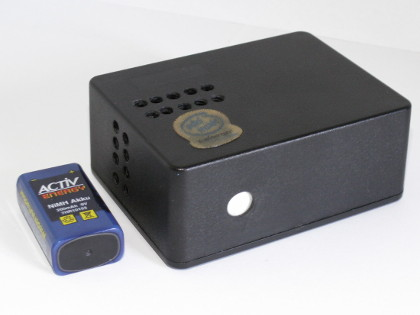
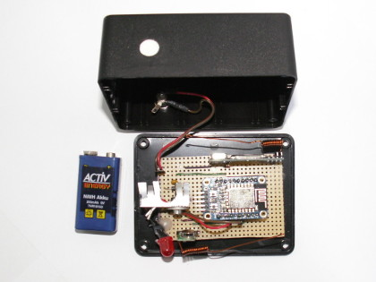

[](https://travis-ci.org/puuu/MQTT433gateway)

# MQTT433gateway

This Project implements a [MQTT](https://en.wikipedia.org/wiki/MQTT)
433.92MHz radio-frequency device gateway.  This is a IoT bridge to
couple popular RF devices like RC power-socket switches or weather
stations to internet capable devices like smartphone and tables.  In
this way they can be integrated into a home automation system.

The Software runs on a ESP8266 micro controller/WiFi chip and process
many 433.92MHz radio-protocols themselves.  The protocols are
processed utilizing the [ESPiLight](https://github.com/puuu/ESPiLight)
Arduino library which is a port of the [pilight](https://pilight.org/)
433.92MHz protocols to the Arduino platform.  The aim is to transmit,
receive and parse many 433.92MHz protocols directly on the device and
publish the results via MQTT.

A list of supported protocols can be found in the pilight manual:
https://manual.pilight.org/protocols/433.92/index.html


## Software/Requirements

The software is using the [PlatformIO](http://platformio.org/) ecosystem. See their
[install instructions](http://docs.platformio.org/en/latest/installation.html) or get
their [IDE](http://docs.platformio.org/en/latest/ide/pioide.html) to get the
software. More information can be found in their [documentation](http://docs.platformio.org/en/latest/).

1. Open a terminal and go to the MQTT433Gateway project folder.

2. After that, decide for which board to create the firmware and give
   this as `--environment` to the platformio `run` command:
   ```console
   $ platformio run --environment <board>
   ```
   The available boards are defined in `platformio.ini`. Currently, this are
   + `esp12e` for ESP8266-12e/f models,
   + `esp12e_160` for ESP8266-12e/f models with cpu clock set to 160MHz,
   + `nodemcuv2` for NodeMCU boards,
   + `d1_mini`for D1 Mini boards,
   + `huzzah` for the Huzzah boards.

3. To flash the firmware to the board, connect the board to the PC via
   USB or a serial adapter. Make sure, it is the only device currently
   connected, as otherwise you might flash the wrong unit
   accidentally. Some boards need to be set manually into a programming
   mode, please check the manual of the board to get more details about
   how to do that.  The `platformio run` has the upload target to
   initialize flashing:
   ```console
   $ platformio run --environment <board> --target upload
   ```
   this will try to autodetect the serial port. If this is not
   successful, try
   ```console
   $ platformio run --environment <board> --target upload --upload-port <path-to-serial-port>
   ```

Older versions of MQTT433gateway were developed with the Arduino
IDE. You can find the old sources in the departed
[`arduino`](../../tree/arduino) branch.


## Hardware

 

The Software is primary written for ESP8266 devices.  It is tested
with an
[Adafruit HUZZAH ESP8266](https://www.adafruit.com/product/2471), but
any other ESP8266 board should be fine too.  The circuitry can be
found in the [`hardware`](hardware/) folder.  The circuitry utilizes a separate 5V
voltage regulator.  This way it is possible to supply the
MQTT433gateway with up to 12V.  The 434MHz transmitter is directly
connected to the power-supply input, thus it can be driven with 12V
which enhances the transmitting range.  But powering with 12V also
means that the voltage regulator dissipates much power and a heat sink
is highly recommended.

For transmitting and receiving you need 434MHz-RF modules.  More
information can be found here:
- https://wiki.pilight.org/receivers
- https://wiki.pilight.org/senders
- https://github.com/sui77/rc-switch/wiki/List_TransmitterReceiverModules

If you are interested in a good receiving range, then I can not
recommend a WRL-10532 module.  I only achieved a range of about 5m
with it, after changing it against a RXB6 receiver, the range
increases to over 30m (including walls).

For the transmitter and receiver module you need separate antennas.
1/4 lambda (17cm) antennas are sufficient, but you may want to try
[coil loaded antennas](https://www.elektor.nl/Uploads/Forum/Posts/How-to-make-a-Air-Cooled-433MHz-antenna.pdf).


### LED status

The MQTT433gateway indicates its status by a LED:
- Connecting to WiFi/startup: Flashing at 1 Hz
- WiFiManager require WiFi configuration: Flashing at 5 Hz
- Device require configuration: Flashing at 0.5 Hz
- Normal operation: Heartbeat pulsing
- OTA Update: on during upload


## Configuration

The device is fully configurable through a web browser.  If you boot it for the
first time, it will create a WiFi access point (default ssid is `rf434`) where
you can connect to.  If you type in any url in your browser, you will get
directed to the WiFi configuration of the device.  You can select your network
here and fill in the credentials.

After that it will stop the access point and connect to your network.  There you
can either discover it via mDNS (default is `rf434.local`), ask your router for
the address of the device or check the serial console output.  If you type this
address in your browser, you'll see the main configuration frontend.  The
default username is `admin`, the default password is `MQTT433gateway`.

Please fill here your MQTT connection details. You can also change the topics
the device will subscribe and publish to.  In addition, all hardware related
settings, like connection pins of transmitter and receiver are configurable.

**Please note:** you have to change the configuration password! For security
reasons the device will not start working before this password is changed.


## MQTT/Automation

The MQTT433gateway communicates via MQTT, therefore a MQTT broker is needed,
e.g., [Mosquitto](https://mosquitto.org/). The topics for receiving and
transmitting can be configured with the `mqttReceiveTopic` and `mqttSendTopic`
settings. They default to `rf434/recv/` and `rf434/send/`, respectively.  It is
possible to use a common topic for multiple gateways in one network and thus to
expand the radio range.

After (re)connecting to the MQTT broker, the gateway sends the message
`{"chipId":"<chipId>","firmware":"<git tag or hash>","state":"online"}` to the
topic that is set to setting `deviceName`.  In addition, it registered with the
last will set to the same message but with `state` set to `offline` for the same
topic. This allows to check the status of the MQTT433gateway.

MQTT subscription is done to the topic `<mqttSendTopic><protocol>`.  The
messages to be transmitted must be a valid pilight JSON messages.  The setting
`mqttSendTopic` should end with a `/`.  `<protocol>` is the pilight protocol
name.  Additionally, `<protocol>` can be `RAW` to transmit a RAW signal similar
as used with the [pilight USB Nano](https://github.com/pilight/pilight-usb-nano/blob/master/pilight_usb_nano.c).

Received and decoded RF signals are published in the
`<mqttReceiveTopic><protocol>[/<id>]` topic as pilight JSON message.  To
avoid receiving errors, a message must be received at least twice
before it is published.  `<protocol>` is the pilight protocol name and
the optional `<id>` will be used if the pilight JSON message contains
an `id` attribute.


### Integration in Home Assistant

Here are some examples how to integrate the MQTT433gateway into
[Home Assistant](https://home-assistant.io).

Status of the MQTT433gateway:

```yaml
binary_sensor:
  - platform: mqtt
    state_topic: "rf434"
    name: "rf434"
    payload_on: "online"
    payload_off: "offline"
    value_template: '{{ value_json.state }}'
```

The message of a TCM 218943 weather station sensor looks like this:
`rf434/recv/tcm/108 {"id":108,"temperature":22.7,"humidity":50,"battery":1,"button":0}`.
A corresponding Home Assistant configuration is:

```yaml
sensor:
  - platform: mqtt
    state_topic: "rf434/recv/tcm/108"
    unit_of_measurement: "°C"
    name: "tcm_a_temp"
    value_template: '{{ value_json.temperature }}'
  - platform: mqtt
    state_topic: "rf434/recv/tcm/108"
    unit_of_measurement: "%"
    name: "tcm_a_humidity"
    value_template: '{{ value_json.humidity }}'

binary_sensor:
  - platform: mqtt
    state_topic: "rf434/recv/tcm/108"
    name: "tcm_a_battery"
    sensor_class: power
    payload_on: 1
    payload_off: 0
    value_template: '{{ value_json.battery }}'
```

Impulse RC socket switches, like many RC socket switches with DIP
switches:

```yaml
switch:
  - platform: mqtt
    name: "impuls_24_1"
    command_topic: "rf434/send/impuls"
    payload_on: '{"systemcode":24,"programcode":1,"on":1}'
    payload_off: '{"systemcode":24,"programcode":1,"off":1}'
  - platform: mqtt
    name: "impuls_24_2"
    command_topic: "rf434/send/impuls"
    payload_on: '{"systemcode":24,"programcode":2,"on":1}'
    payload_off: '{"systemcode":24,"programcode":2,"off":1}'
  - platform: mqtt
    name: "impuls_24_3"
    command_topic: "rf434/send/impuls"
    payload_on: '{"systemcode":24,"programcode":4,"on":1}'
    payload_off: '{"systemcode":24,"programcode":4,"off":1}'
```

Elro 800 based RC socket switches:

```yaml
switch:
  - platform: mqtt
    name: "elro800_13_A"
    command_topic: "rf434/send/elro_800_switch"
    payload_on: '{"systemcode":13,"unitcode":1,"on":1}'
    payload_off: '{"systemcode":13,"unitcode":1,"off":1}'
  - platform: mqtt
    name: "elro800_13_B"
    command_topic: "rf434/send/elro_800_switch"
    payload_on: '{"systemcode":13,"unitcode":2,"on":1}'
    payload_off: '{"systemcode":13,"unitcode":2,"off":1}'
  - platform: mqtt
    name: "elro800_13_C"
    command_topic: "rf434/send/elro_800_switch"
    payload_on: '{"systemcode":13,"unitcode":4,"on":1}'
    payload_off: '{"systemcode":13,"unitcode":4,"off":1}'
  - platform: mqtt
    name: "elro800_13_D"
    command_topic: "rf434/send/elro_800_switch"
    payload_on: '{"systemcode":13,"unitcode":8,"on":1}'
    payload_off: '{"systemcode":13,"unitcode":8,"off":1}'
```

Quigg GT9000 based RC socket switches, e.g., Tevion GT-9000,
SilverCrest 91210 or Intertek Unitec 48110:

```yaml
switch:
  - platform: mqtt
    name: "gt9000_590715_0"
    command_topic: "rf434/send/quigg_gt9000"
    payload_on: '{"id":590715,"unit":0,"on":1}'
    payload_off: '{"id":590715,"unit":0,"off":1}'
  - platform: mqtt
    name: "gt9000_590715_2"
    command_topic: "rf434/send/quigg_gt9000"
    payload_on: '{"id":590715,"unit":2,"on":1}'
    payload_off: '{"id":590715,"unit":2,"off":1}'
  - platform: mqtt
    name: "gt9000_590715_3"
    command_topic: "rf434/send/quigg_gt9000"
    payload_on: '{"id":590715,"unit":3,"on":1}'
    payload_off: '{"id":590715,"unit":3,"off":1}'
```


## OTA Update

Updates of the MQTT433gateway can be preformed by OTA (Over-the-air programming)
via the web frontend.  To do this, you need the binary file that can be found at
`<BUILD_DIR>/firmware.bin`, e.g. `.pioenvs/huzzah/firmware.bin`.


## Debugging/RF-protocol analyzing

The MQTT433gateway has a powerful logging system based on
[ArduinoSimpleLogging](https://github.com/janLo/ArduinoSimpleLogging).  Messages
for different log levels can be logged to serial interface, websocket (web
frontend) and syslog server.  The configuration can be done via web frontend.
The log messages could be very helpful for debugging.  In addition, RF-protocol
analyzing can be enabled with the `protocolRaw` debug flag.


## Protocol limitation

If you have the situation that there is a lot of noise in the air
and/or your device matches multiple protocols, you can limit the
available protocols.  This is easily possible with via the web frontend.


## Contributions

If you find any bug, please feel free to fill an issue.  Also, pull request are
welcome.  More information can be found in the [contributing guide](CONTRIBUTING.md).


## Acknowledgement

Big thanks goes to the pilight community, which implemented all the
434MHz protocols.  If you want to integrate more protocols, please
contribute directly to [pilight](https://pilight.org/).

Many thanks goes to [@janLo](https://github.com/janLo), who developed the web
configuration interface.
